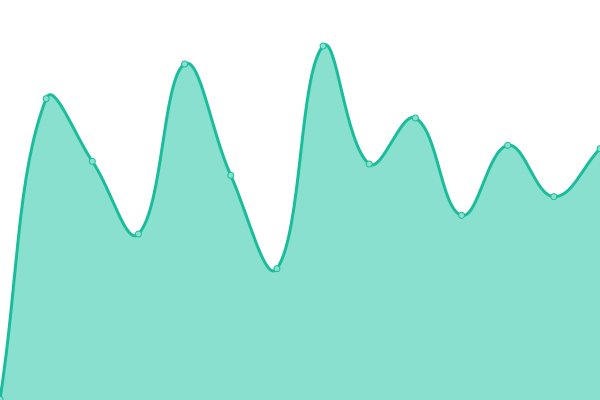
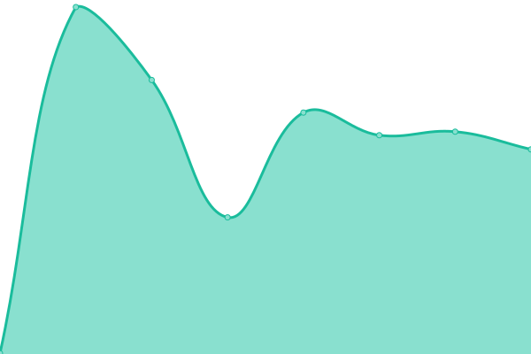
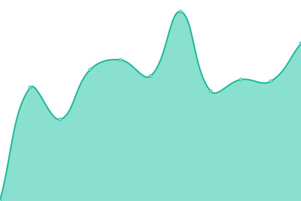

# [📈 Live Status](https://xcash-rocks.github.io/uptime): <!--live status--> **🟧 Partial outage**

This repository contains the open-source uptime monitor and status page for [xcash.rocks](https://xcash.rocks/), powered by [Upptime](https://github.com/upptime/upptime).

With [Upptime](https://upptime.js.org), you can get your own unlimited and free uptime monitor and status page, powered entirely by a GitHub repository. We use [Issues](https://github.com/xcash-rocks/uptime/issues) as incident reports, [Actions](https://github.com/xcash-rocks/uptime/actions) as uptime monitors, and [Pages](https://xcash-rocks.github.io/uptime) for the status page.

<!--start: status pages-->
<!-- This summary is generated by Upptime (https://github.com/upptime/upptime) -->
<!-- Do not edit this manually, your changes will be overwritten -->
<!-- prettier-ignore -->
| URL | Status | History | Response Time | Uptime |
| --- | ------ | ------- | ------------- | ------ |
|  [xcash.rocks](http://node.xcash.rocks) | 🟩 Up | [xcash-rocks.yml](https://github.com/xcash-rocks/uptime/commits/HEAD/history/xcash-rocks.yml) | 

 499ms
     
 | 

<a href="https://xcash-rocks.github.io/uptime/history/xcash-rocks">98.28%</a>
    

|  [lowfee.xcash.rocks](http://lowfee.xcash.rocks) | 🟥 Down | [lowfee-xcash-rocks.yml](https://github.com/xcash-rocks/uptime/commits/HEAD/history/lowfee-xcash-rocks.yml) | 

 345ms
     
 | 

<a href="https://xcash-rocks.github.io/uptime/history/lowfee-xcash-rocks">98.06%</a>
    

|  [pi.xcash.rocks](http://pi.xcash.rocks) | 🟩 Up | [pi-xcash-rocks.yml](https://github.com/xcash-rocks/uptime/commits/HEAD/history/pi-xcash-rocks.yml) | 

 377ms
     
 | 

<a href="https://xcash-rocks.github.io/uptime/history/pi-xcash-rocks">99.80%</a>
    

|  [crazy.xcash.rocks](http://crazy.xcash.rocks) | 🟥 Down | [crazy-xcash-rocks.yml](https://github.com/xcash-rocks/uptime/commits/HEAD/history/crazy-xcash-rocks.yml) | 

 0ms
     
 | 

<a href="https://xcash-rocks.github.io/uptime/history/crazy-xcash-rocks">0.00%</a>
    

<!--end: status pages-->

[**Visit our status website →**](https://xcash-rocks.github.io/uptime)

## 📄 License

- Powered by: [Upptime](https://github.com/upptime/upptime)
- Code: [MIT](./LICENSE) © [xcash.rocks](https://xcash.rocks/)
- Data in the `./history` directory: [Open Database License](https://opendatacommons.org/licenses/odbl/1-0/)
